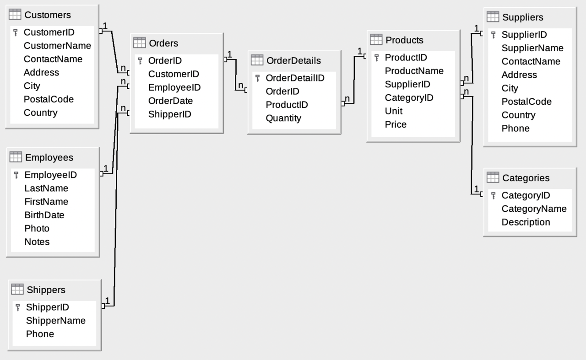

# Northwind Traders Sales Analysis (SQL Portfolio)

  
*(Entity-Relationship diagram of the Northwind database)*

End-to-end SQL analysis of the classic **Northwind** sample database (a fictional trading company) to uncover sales trends, customer behavior, product performance, and growth opportunities.

This project demonstrates:
- Relational querying (joins, aggregations, date functions)
- Business-oriented insights (revenue trends, normalized growth, partial-year handling)
- Clean, commented SQL code
- Data storytelling and recommendations

Built as part of my transition into data analysis roles, leveraging my quantitative foundation from a **Math & Physics degree at Trent University**.

## Project Overview

**Skills demonstrated**: PostgreSQL, SQL (joins, CTEs, window functions, aggregations), business insight generation, data storytelling.

**Database**: PostgreSQL + Northwind Traders sample  
- ~830 orders, 2155 line items  
- Tables: orders, order_details, customers, products, categories, employees, etc.  
- Data span: July 1996 – May 1998 (partial years at start/end)

**Tools Used**  
- PostgreSQL (pgAdmin / psql)  
- SQL for querying and analysis  
- Markdown for documentation

**Setup Instructions**  
1. Create a new database named `northwind` in PostgreSQL.  
2. Run the `northwind.sql` script (schema + data load) — available in this repo or from [pthom/northwind_psql](https://github.com/pthom/northwind_psql).  
3. Execute queries from the `queries/` folder.

## Key Analyses (Completed So Far)

### Quick Summary of Analyses

| # | Analysis                            | Key Metric                          | Top Insight                              |
|---|-------------------------------------|-------------------------------------|------------------------------------------|
| 1 | Total Revenue                       | $1,265,793.04                       | Overall business scale                   |
| 2 | Revenue Trend (Normalized)          | 1997: +47% daily avg                | Strong growth, partial-year handling     |
| 3 | Category Revenue + Avg Unit Price   | Beverages $268k ($28.10/unit)       | Meat/Poultry highest avg price ($38.82)  |
| 4 | Top 10 Products                     | Côte de Blaye $141k (24 orders)     | Premium items dominate despite low volume|

### 1. Total Revenue
- File: [queries/Total_Revenue.sql](queries/Total_Revenue.sql)  
- Question: What is the overall revenue after discounts?  
- Result: **$1,265,793.04**  
- Insight: Provides baseline business scale for all subsequent analyses.

### 2. Revenue & Order Volume Trend by Year (with Normalized Growth)
- File: [queries/revenue_trend_with_normalized_growth.sql](queries/revenue_trend_with_normalized_growth.sql)  
- Questions:  
  - How has revenue and order volume changed over time?  
  - What is the true growth rate when accounting for partial years (1996 & 1998)?  
- Key Results:
  - 1996: $208,083.97 | 152 orders | 181 active days | Daily avg: $1,149.64
  - 1997: $617,085.20 | 408 orders | 365 active days | Daily avg: $1,690.64 (+47.06% vs 1996)
  - 1998: $440,623.87 | 270 orders | 126 active days | Daily avg: $3,497.01 (+106.85% vs 1997)

- Insights:
  - Strong revenue growth from partial 1996 to full 1997 (~3× increase).
  - Daily performance accelerated significantly into 1998, even with only ~4 months of data — indicates improving efficiency/momentum.
  - Normalization using active days avoids misleading conclusions from partial-year totals.

### 3. Revenue & Units Sold by Product Category (with Avg Revenue per Unit)
**File**: [queries/revenue_by_category.sql](queries/revenue_by_category.sql)

**Key results** (sorted by total revenue):

- **Beverages** — $267,868.18 (9,532 units) → **$28.10** per unit
- **Dairy Products** — $234,507.28 (9,149 units) → **$25.63** per unit
- **Meat/Poultry** — $163,022.36 (4,199 units) → **$38.82** per unit (highest avg price)

**Insights**:
- Beverages dominate total revenue and volume, but **Meat/Poultry** achieves the highest revenue per unit — likely premium/high-margin items.
- Seafood has the lowest avg revenue per unit despite solid volume — potential area for price optimization or bundling strategies.

### 4. Top 10 Products by Revenue
**File**: [queries/top_10_products.sql](queries/top_10_products.sql)

**Business question**: Which individual products generate the most revenue?  
Helps identify flagship/high-value items.

**Top 10 results** (sorted by revenue):

- **Côte de Blaye** (Beverages) — $141,396.74 (623 units, 24 orders)
- **Thüringer Rostbratwurst** (Meat/Poultry) — $80,368.67 (746 units, 32 orders)
- **Raclette Courdavault** (Dairy Products) — $71,155.70 (1,496 units, 54 orders)
- **Tarte au sucre** (Confections) — $47,234.97 (1,083 units, 48 orders)
- **Camembert Pierrot** (Dairy Products) — $46,825.48 (1,577 units, 51 orders)
- ... (and so on)

**Insights**:
- **Côte de Blaye** dominates despite low volume — extremely high unit price and value per order.
- Dairy and Meat/Poultry products appear frequently — strong category performers.
- Products like Raclette have broad reach (many orders) vs. high-value niche items like Côte de Blaye (fewer but larger orders).
- Opportunity: Focus promotions/stock on these top 10; investigate why lower-ranked items underperform.

## Entity-Relationship Diagram

(If the image doesn't display, download a clean version from:  
- Microsoft Support: https://support.microsoft.com/en-us/office/northwind-database-diagram-cd422d47-e4e3-4819-8100-cdae6aaa0857  
- Wikiversity: https://en.wikiversity.org/wiki/File:Northwind_E-R_Diagram.png  
Save as `images/northwind_er_diagram.png`)

## Next Steps / In Progress
- Discount impact analysis
- Employee performance
- Top customers by spend
- Python EDA project (Superstore dataset)

## About Me
Math & Physics graduate (Trent University, Peterborough, ON)  
Transitioning into data analysis — building skills in SQL, Python, data storytelling, and insight generation.  
Open to feedback, collaboration, or entry-level opportunities!

Questions or suggestions? Feel free to open an issue or connect on LinkedIn / X (@Tejas55065247).

Last updated: March 2026